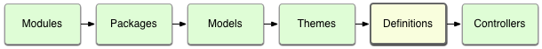

## Example: Controller Cancel

This example shows how to use a framework event to intercept, cancel and redirect controller routing.

Features covered by this example:

* [Controllers](http://docs.totaljs.com/latest/en.html#pages~Controllers) - route URL requests to code
* [Definitions](http://docs.totaljs.com/latest/en.html#pages~Definitions) - coded config files
* [`ROUTE()`](http://docs.totaljs.com/latest/en.html#api~Framework~framework.route)) - define a route
* [`ON('controller')`](http://docs.totaljs.com/latest/en.html#api~Framework~ON('controller')) - intercept controller requests
* [`controller.cancel()`](http://docs.totaljs.com/latest/en.html#api~FrameworkController~controller.cancel) - cancel a request
* [`controller.redirect()`](http://docs.totaljs.com/latest/en.html#api~FrameworkController~controller.redirect) - redirect a request
* [`controller.url`](http://docs.totaljs.com/latest/en.html#api~FrameworkController~controller.url) - determine request path
* [`controller.transfer()`](http://docs.totaljs.com/latest/en.html#api~FrameworkController~controller.transfer) - transfer a request
* [`controller.isTransfer`](http://docs.totaljs.com/latest/en.html#api~FrameworkController~controller.isTransfer) - detect a transfer

### Routing

The controller (`/controllers/default.js`) defines two routes:

```javascript
ROUTE( '/',        view_index);
ROUTE( '/cancel/', view_cancel);
```

We're going to make `/` route to `view_cancel` instead of `view_index`. The hard way (:

### Redirecting

We'll put our code in a definition file (`/definitions/cancel.js`) - definitions are initialised just before controllers as shown below:



First, we need to listen to the framework event for controllers: `ON('controller')`:

```javascript
ON('controller', function(controller, name) {
	// this will be triggered on every request to the controller
});
```

The most simplistic (and disastrous) way to redirect to `/cancel/` is as follows:

```javascript
ON('controller', function( controller, name ) {
	controller.cancel().redirect('/cancel/');
});
```

This cancels any request in the controller, regardless of route, and then redirects to `/cancel/` ...which is itself a request and so it too will be intercepted, cancelled and redirected to `/cancel/`... over and over again.

Let's fix that:

```javascript
ON('controller', function( controller, name ) {
	if (controller.url === '/')
		controller.cancel().redirect('/cancel/');
});
```

Now, only requests to `/` will be redirected to `/cancel/`, and requests to `/cancel/` will be successful.

## Transferring

At first glance, transfers work just the same as redirects:

```javascript
ON('controller', function(controller, name) {
	if (controller.url === '/')
		controller.cancel().transfer( '/cancel/' );
});
```

However, there's a major benefit to using `.transfer()`: You can identify them using `.isTransfer`.

Let's say you wanted to temporarilly cancel any route in your controller, for example due to site maintenance. You could do something like this:


```javascript
ON('controller', function( controller, name ) {

	if (!controller.isTransfer) // <-- exclude existing transfers
		controller.cancel().transfer('/cancel/');

});
```